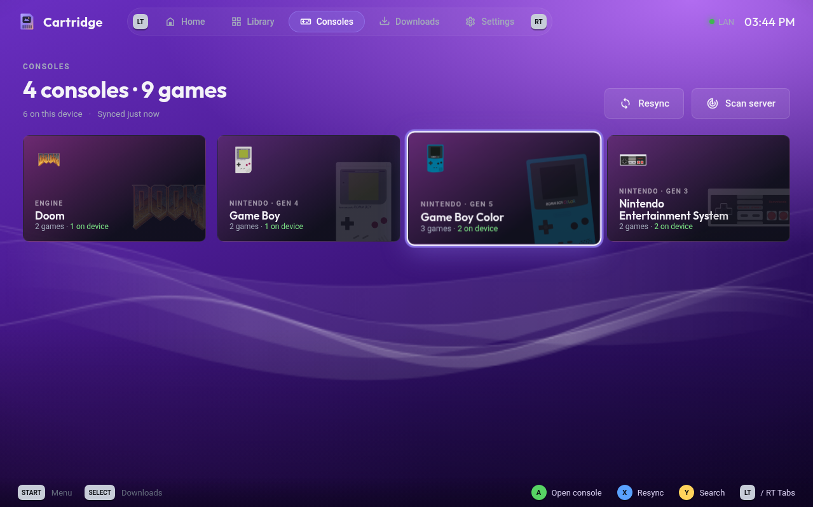
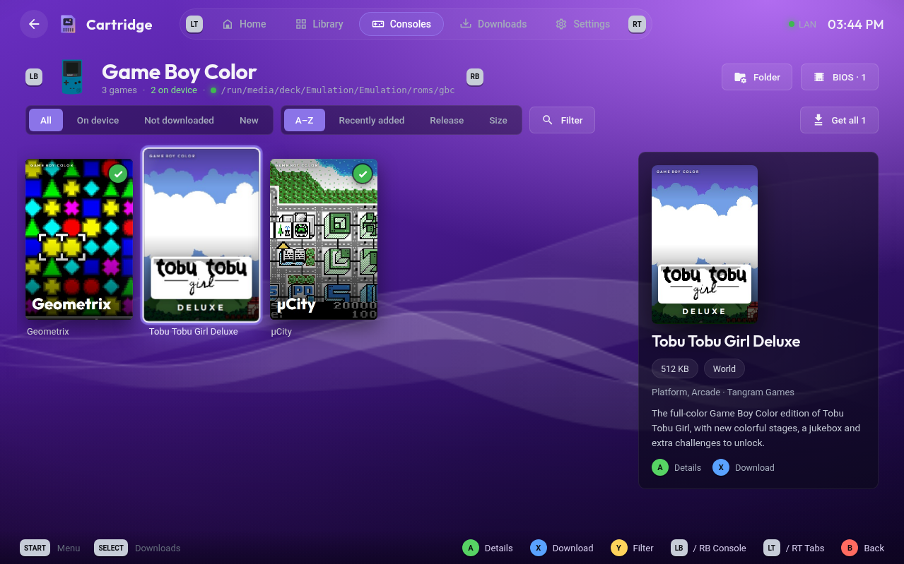
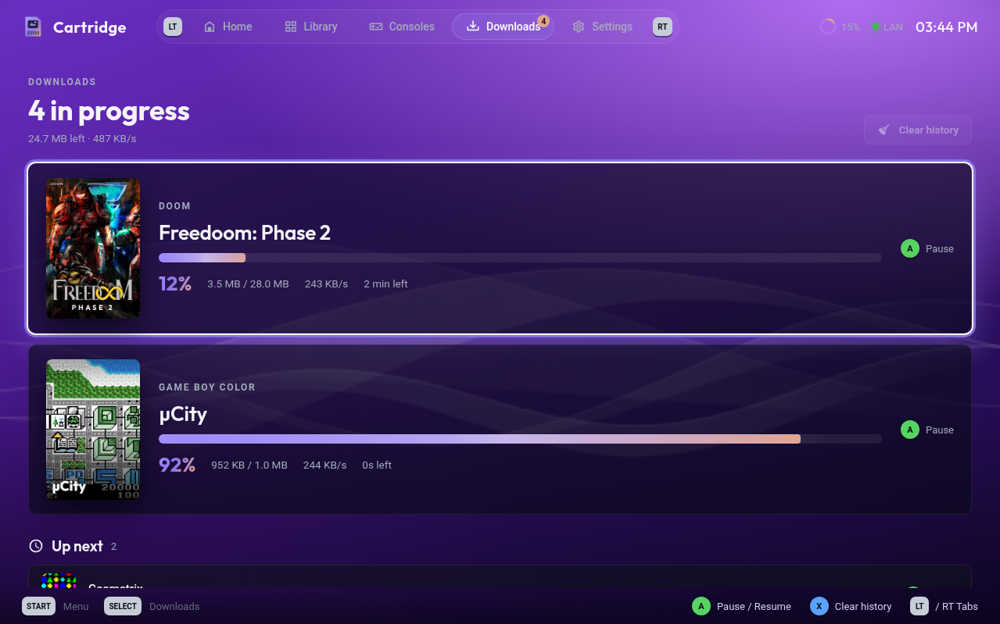
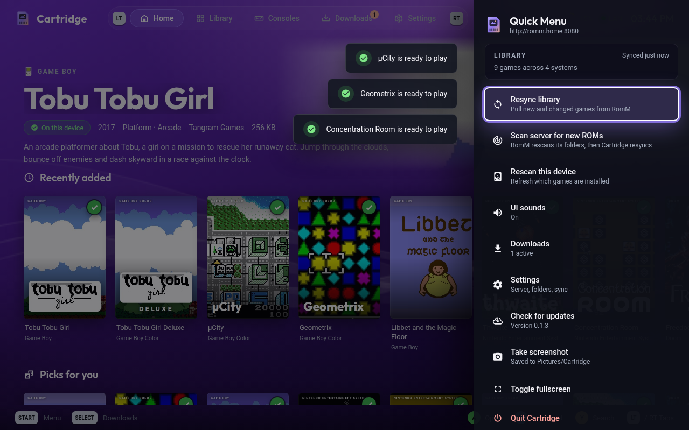

<div align="center">


### Your RomM library, on the couch.

A controller-first [RomM](https://github.com/rommapp/romm) client for **SteamOS** and **Bazzite**.<br>
Browse your whole library in Game Mode and pull games straight into your EmuDeck / ES-DE folders.

[](https://github.com/abdu2304/cartridge/releases/latest)
[](https://github.com/abdu2304/cartridge/releases)
[](#install)
[](LICENSE)

<a href="https://github.com/abdu2304/cartridge/releases/latest/download/Cartridge-x86_64.AppImage"></a>

<br><br>


</div>

<br>

## ✦ Highlights

<table>
<tr>
<td width="50%" valign="top">

**🎮 Made for Game Mode**<br>
Every screen works with a controller: D-pad navigation, an on-screen keyboard, button hints, a Quick Menu on Start and soft UI sounds. Tap the screen and it switches to a proper touch mode with no cursor.

</td>
<td width="50%" valign="top">

**🗂 Straight from RomM**<br>
Covers, screenshots, descriptions, genres, developers, ratings, console icons and collections all come from your RomM server. Nothing is scraped twice.

</td>
</tr>
<tr>
<td valign="top">

**📥 Lands in the right folder**<br>
Each console is matched to its ES-DE folder inside your EmuDeck `roms` directory, with per-console overrides. Downloads resume, multi-disc games get an `.m3u`, and BIOS files come from RomM too.

</td>
<td valign="top">

**🔄 Always in sync**<br>
Your library is mirrored locally, so it opens instantly and works offline. Resync or ask RomM to scan for new ROMs from the couch, and new games get a NEW badge.

</td>
</tr>
<tr>
<td valign="top">

**🚂 One-click Add to Steam**<br>
Settings → Steam adds Cartridge to your library as a non-Steam game, complete with cover, banner, logo and icon.

</td>
<td valign="top">

**⬆️ Updates in place**<br>
Settings → Updates checks GitHub Releases and swaps in the new version on restart. Same file, same Steam shortcut, nothing to reinstall.

</td>
</tr>
<tr>
<td valign="top">

**🎨 Make it yours**<br>
PSP XMB-style animated waves in eight colors, a media bar that shows the highlighted game's artwork, and three box art sizes.

</td>
<td valign="top">

**⚡ Smooth on handhelds**<br>
GPU rendering with an automatic fallback, lazy-loaded grids and a cached image store keep it at 60fps on an Ally or a Deck.

</td>
</tr>
</table>

<br>

## ✦ Tour

<table>
<tr>
<td width="50%"><p align="center"><b>Library</b> · every game, filter by console, collection or status</p></td>
<td width="50%"><p align="center"><b>Consoles</b> · your RomM platforms with icons and counts</p></td>
</tr>
<tr>
<td><p align="center"><b>Console view</b> · box art grid with a live details panel</p></td>
<td><p align="center"><b>Game page</b> · metadata, screenshots and one-button download</p></td>
</tr>
<tr>
<td><p align="center"><b>Downloads</b> · queue, progress, pause and resume</p></td>
<td><p align="center"><b>Look &amp; feel</b> · colors, media bar, touch mode</p></td>
</tr>
<tr>
<td><p align="center"><b>Quick Menu</b> · resync, scan, updates, screenshots</p></td>
<td></td>
</tr>
</table>

<br>

## ✦ Install

**One line** (Desktop Mode → Konsole):

```bash
curl -fsSL https://raw.githubusercontent.com/abdu2304/cartridge/main/install.sh | bash
```

This downloads the latest AppImage to `~/Applications`, makes it executable and adds Cartridge to your app menu. Then open Cartridge and use **Settings → Steam → Add to Steam** to get it into Game Mode, with its cover, banner, logo and icon.

**Manual:** download [`Cartridge-x86_64.AppImage`](https://github.com/abdu2304/cartridge/releases/latest/download/Cartridge-x86_64.AppImage), right-click it → **Properties → Permissions → Is executable**, and double-click it. Keep the file name as it is, because updates replace it in place.

**Updating:** open **Settings → Updates → Check for updates**, or pick it from the Quick Menu. The new version downloads in the background and replaces the AppImage when you restart, so your Steam shortcut keeps working.

> **Blank window?** Cartridge uses the GPU and switches itself to software rendering if the GPU process fails. You can also force it with **Settings → Look & feel → Rendering → Compatible**, or launch once with `./Cartridge-x86_64.AppImage --disable-gpu`. A log is kept at `~/.config/Cartridge/cartridge.log`.

<br>

## ✦ Connecting to RomM

| | |
|---|---|
| **Addresses** | A LAN address, a Cloudflare Tunnel address, or both. In **Auto** mode Cartridge uses the LAN when you're home and falls back to the tunnel. |
| **Sign-in** | Username & password, a RomM **pairing code**, or an `rmm_` API token. |
| **Cloudflare Access** | Optional service-token headers if your tunnel sits behind Zero Trust. |
| **Server scans** | "Scan server for new ROMs" needs username & password sign-in. |

<br>

## ✦ Controls

| Button | Action |
|:---:|---|
| **D-pad / Stick** | Move |
| **A** | Select |
| **B** | Back |
| **X** | Download highlighted game |
| **Y** | Search |
| **LT / RT** | Switch tabs (Home, Library, Consoles, Downloads, Settings) |
| **LB / RB** | Inside a console or collection: previous / next |
| **Select** | Downloads · in a grid: cycle All / On device / Not downloaded / New |
| **Start** | Quick Menu (resync, scan, updates, screenshot) |
| **Touch** | Tap anything. The cursor only appears when a mouse moves |

<br>

## ✦ Build from source

```bash
npm install
npm start       # run in development
npm run dist    # build release/Cartridge-x86_64.AppImage
```

Bumping `version` in `package.json` on `main` builds the AppImage on GitHub Actions and publishes it as a release. Installed copies pick it up automatically.

Settings and the library cache live in `~/.config/Cartridge/`.

<br>

## ✦ Demo library credits

The screenshots use a demo RomM library made only of free, open-source homebrew games. Covers are composed from each game's own title screens and artwork, used under their licenses:

| Game | Platform | By | License |
|---|---|---|---|
| [Tobu Tobu Girl](https://github.com/SimonLarsen/tobutobugirl) · [Deluxe](https://github.com/SimonLarsen/tobutobugirl-dx) | Game Boy / Color | Tangram Games | MIT · assets CC BY 4.0 |
| [µCity](https://github.com/AntonioND/ucity) | Game Boy Color | AntonioND | GPL-3.0 |
| [Geometrix](https://github.com/AntonioND/geometrix) | Game Boy Color | AntonioND | GPL-3.0 |
| [Libbet and the Magic Floor](https://github.com/pinobatch/libbet) | Game Boy | Damian Yerrick | zlib |
| [Thwaite](https://github.com/pinobatch/thwaite-nes) | NES | Damian Yerrick | GPL-3.0 |
| [Concentration Room](https://github.com/pinobatch/croom-nes) | NES | Damian Yerrick | GPL-3.0 |
| [Freedoom: Phase 1 & 2](https://github.com/freedoom/freedoom) | Doom engine | The Freedoom Project | BSD-3-Clause |

<br>

<div align="center"><sub>Cartridge is an unofficial client and isn't affiliated with the RomM project.</sub></div>
