<div align="center">

<picture>
  <source media="(prefers-color-scheme: dark)" srcset="docs/readme/logo-dark.png">
  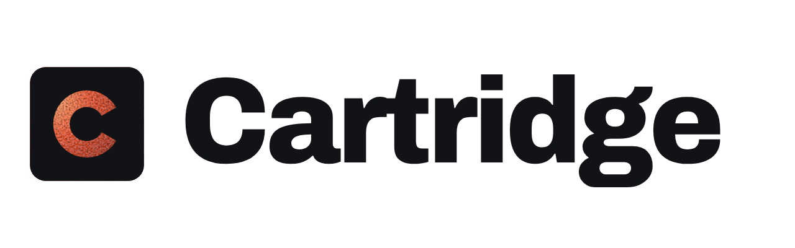
</picture>

### Your RomM library, set up for your controller.

A controller-first [RomM](https://github.com/rommapp/romm) client for **SteamOS**, **Bazzite**, any Linux desktop and **Android**.<br>
One AppImage and one APK. Browse from the couch, download, play, and keep your saves on your own server.

[](https://github.com/abdu2304/cartridge/releases/latest)
[](https://github.com/abdu2304/cartridge/releases)
[](#install)
[](LICENSE)

<a href="https://github.com/abdu2304/cartridge/releases/latest/download/Cartridge-x86_64.AppImage"></a>
<a href="https://github.com/abdu2304/cartridge/releases/latest/download/Cartridge-android.apk"></a>

<br><br>

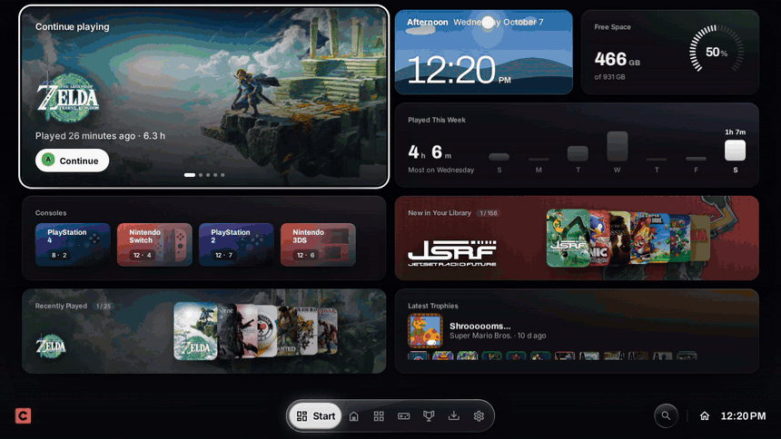

</div>

<br>

## Four looks, one app

Two styles designed separately, **Glass** (see-through, with real refraction) and **Plain** (solid and matte), in any colour, plus Light and OLED black.

<table>
<tr>
<td width="50%">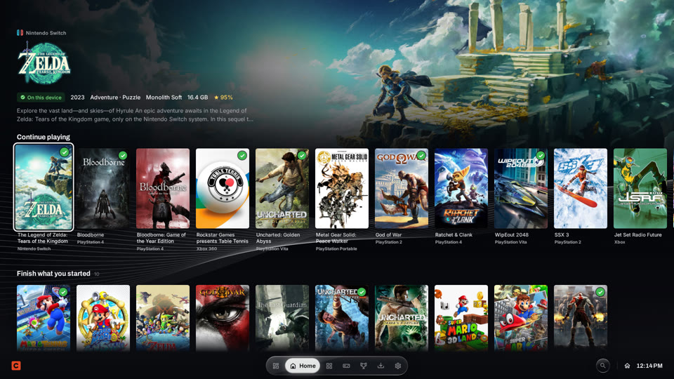<p align="center"><b>Glass</b></p></td>
<td width="50%">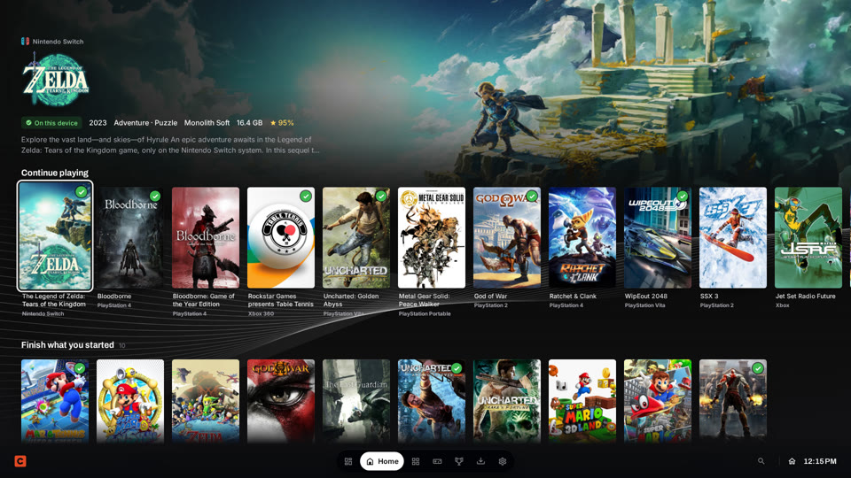<p align="center"><b>Plain</b></p></td>
</tr>
<tr>
<td>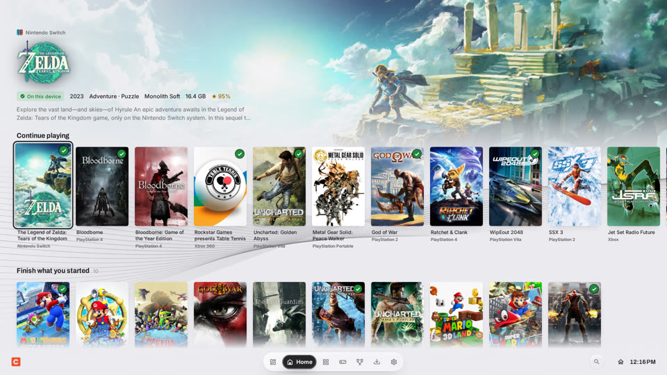<p align="center"><b>Light</b></p></td>
<td>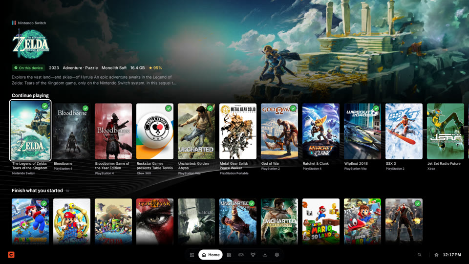<p align="center"><b>OLED</b></p></td>
</tr>
</table>

<br>

## Start

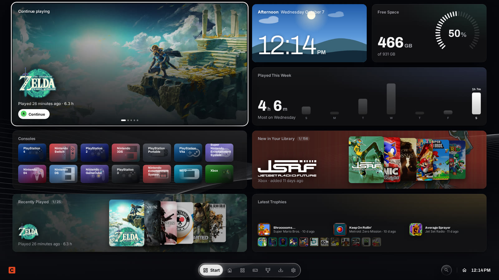

Your own board of tiles: what you're playing, the time, free space, your week, new games, trophies. Arrange it with the controller, touch or a mouse, across as many pages as you like.

## Home


Continue where you left off, finish what you started, and find something new. The background and logo follow whatever you highlight.

## A game

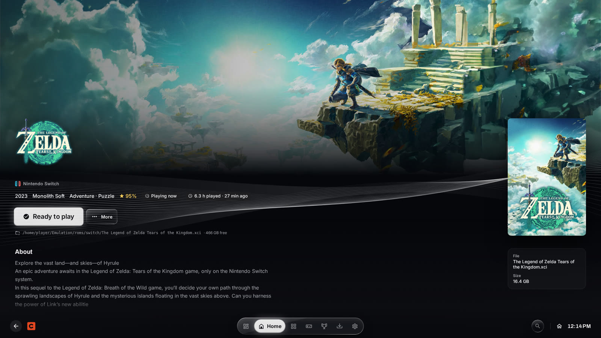

Download it into the right folder, play it, or add it to Steam with the right emulator and artwork. Everything else for the game is one button away:

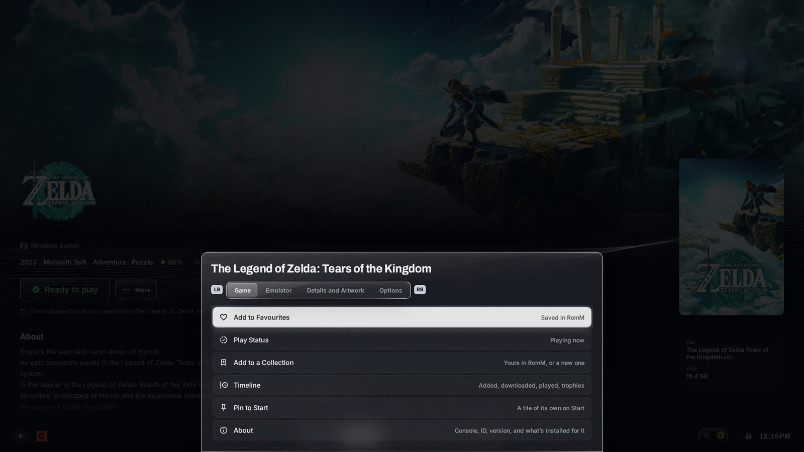

## Every console

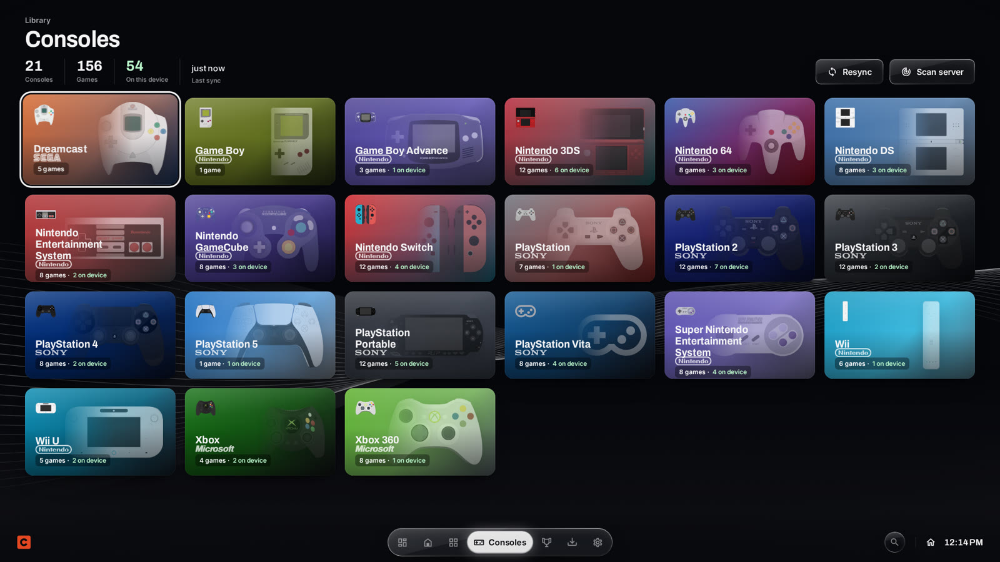

Every console on your RomM server, with what's on this device.

## Achievements

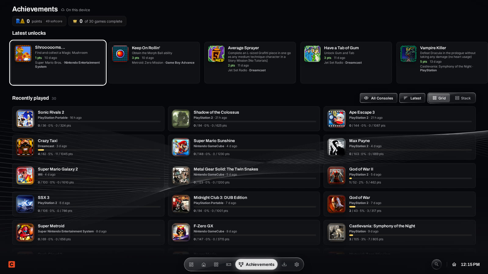

RetroAchievements, plus trophies and Gamerscore from RPCS3, shadPS4, Xenia, Vita3K and KytyPS5, all on one page and kept in step between your devices.

<br>

## What else it does

<details>
<summary><b>Emulators, set up for you</b></summary>

Cartridge finds your emulators however they're installed (EmuDeck, Flatpak, AppImages, distro packages, RetroDECK, Steam), gets and updates new ones, places BIOS and firmware, and installs PS3 and Vita packages. It never changes an emulator's files without asking.
</details>

<details>
<summary><b>Your games in Steam</b></summary>

Downloaded games go into Steam with artwork and console collections, launching exactly like the shortcuts you already have (Steam ROM Manager, EmuDeck or your own). Preview first, undo any time. Cartridge adds itself to Steam in one step too.
</details>

<details>
<summary><b>Saves on your own server</b></summary>

Cartridge Save Sync keeps your saves on your RomM server and brings them to every device, checking before a game starts like Steam Cloud. Away from home with no way to reach your server, your saves stay on the device and go up when it's back. A save is never touched while its emulator is open, and when two devices changed the same save, you choose. Syncthing works too.
</details>

<details>
<summary><b>Mods, texture packs, patches and ROM hacks</b></summary>

From GameBanana, EmuCoreX, Nexus Mods (with your own key) and ROM hacks (Beta), installed where each emulator expects them: PCSX2, DuckStation, PPSSPP, Dolphin, Azahar, Cemu, Eden, Ryujinx and shadPS4. Patches and cheats for RPCS3, shadPS4, PCSX2, Dolphin, PPSSPP and Cemu, and per-game settings.
</details>

<details>
<summary><b>Android too, with a dual-screen companion</b></summary>

The same app as an APK, built from the same code on every release. It finds your ROM folders on internal storage and SD cards and saves each game into its console folder. Controllers, touch and the back gesture all work. On the AYN Thor and other dual-screen devices, the bottom screen becomes a touch companion: the highlighted game with a Download button, live download progress and a touch d-pad for the top screen.
</details>

<details>
<summary><b>Handheld to TV</b></summary>

The interface sizes itself from a Steam Deck to a 4K TV. Motion runs on Cartridge's own animation engine, and Cartridge goes quiet when you're idle and nearly silent while a game runs. The library is mirrored on the device, so it opens at once and still shows everything offline.
</details>

<br>

## Install

**One line** (Desktop Mode → Konsole):

```bash
curl -fsSL https://raw.githubusercontent.com/abdu2304/cartridge/main/install.sh | bash
```

This downloads the latest AppImage to `~/Applications`, makes it executable and adds Cartridge to your app menu. Then open Cartridge and use **Settings → Steam → Add to Steam** to get it into Game Mode, with its cover, banner, logo and icon.

**Manual:** download [`Cartridge-x86_64.AppImage`](https://github.com/abdu2304/cartridge/releases/latest/download/Cartridge-x86_64.AppImage), right-click it → **Properties → Permissions → Is executable**, and double-click it. Keep the file name as it is, because updates replace it in place.

**Updating:** open **Settings → Updates → Check for updates**, or pick it from the Quick Menu. The new version downloads in the background and replaces the AppImage when you restart, so your Steam shortcut keeps working.

### Android

Every release also ships **`Cartridge-android.apk`** on the [Releases page](https://github.com/abdu2304/cartridge/releases/latest), built from the same code as the AppImage. Install it (allow installs from your browser or file manager), open Cartridge and press **Settings → Android → Allow access to all files** so games can be saved straight into your ROM folders.

- **ROM folders are found for you.** Cartridge looks on internal storage and SD cards for `ROMs`, `Emulation/roms` and the ES-DE ROM directory, and uses per-console folders like `nds`, `n3ds`, `psp`, `ps2` or `switch` inside it. A console folder that sits somewhere else (like `NDS` at the top of the SD card) is picked up too.
- **Same controls, plus touch.** Built-in and Bluetooth controllers work exactly like on the Deck; the whole interface is also touch friendly. The back button/gesture goes back.
- **Dual screen (AYN Thor and other dual-screen devices).** The bottom screen becomes a touch companion: the highlighted game with its cover and a Download button, live download progress, and a touch d-pad for the top screen. On single-screen devices this never shows up.
- **Downloads keep going in the background** with a notification, and **updates** download from GitHub Releases in-app (Android asks before installing).

The Android-only settings live in **Settings → Android** and only exist in the APK; the desktop app is unchanged.

### Phone remote

Use any phone on your Wi-Fi as a remote and second screen for every Cartridge in the house (Android and Deck/desktop). No app to install.

1. On the device, open **Settings → Phone Remote** (or **Quick Menu → Connect a phone**) and turn it on.
2. Scan the QR code with your phone's camera, or open the address shown there (like `http://192.168.1.20:47280`) in the phone's browser.
3. The phone lists every Cartridge on the network. Tap one, type the 6-digit code shown on its screen, and the phone is remembered. The QR code skips the code.

From the phone you can see what's on screen, use touch controls, browse the library, choose which device a game downloads to (with its folder and free space), follow every device's downloads, and see battery and storage per device. Phones can't change settings or delete anything, and each device can remove paired phones at any time. The phone and the device need to be on the same network.

> **Won't start from Steam?** Press Settings → Steam → Add to Steam again after updating, so Steam uses Cartridge's launch script. Each Steam launch is logged to `~/.config/Cartridge/steam-launch.log`. **Blank window?** Cartridge restarts once without the GPU if the GPU process fails at start. You can also launch once with `./Cartridge-x86_64.AppImage --disable-gpu`. A log is kept at `~/.config/Cartridge/cartridge.log`.

<br>

## Connecting to RomM

| | |
|---|---|
| **Addresses** | A LAN address, a Cloudflare Tunnel address, or both. In **Auto** mode Cartridge uses the LAN when you're home and falls back to the tunnel. |
| **Sign-in** | Username & password, a RomM **pairing code** or **QR code**, or an `rmm_` API token. |
| **Cloudflare Access** | Optional service-token headers if your tunnel sits behind Zero Trust. |
| **Server scans** | "Scan server for new ROMs" needs username & password sign-in. |

<br>

## Controls

| Button | Action |
|:---:|---|
| **D-pad / Left stick** | Move |
| **Right stick** | Scroll |
| **A** | Select · hold to arrange Start or open a row's details |
| **B** | Back |
| **X** | Download the highlighted game, or the page's action |
| **Y** | Search, or More on a game page |
| **LT / RT** | Switch top tabs |
| **LB / RB** | Switch sections inside a page |
| **Select** | Downloads |
| **Start** | Quick Menu (resync, scan, updates, screenshot) |
| **Touch** | Tap, swipe to scroll, swipe from the left edge to go back, swipe the tabs to switch them |
| **Keyboard** | Arrows, Enter, Esc; Tab moves focus, 1 to 9 pick a tab, Ctrl+F or / searches, F1 lists the keys |
| **Android back** | Back (the button or the gesture) |

<br>

## Under the hood

Cartridge is Electron with a Vue 3 interface and no UI, state or animation library: the engines are its own.
[docs/architecture.md](docs/architecture.md) maps them all. The main ones:

- **CAE, the Cartridge Animation Engine** ([docs/cae.md](docs/cae.md)): springs, one frame loop, shared-element flights, and a governor that quiets Cartridge while you're idle or playing.
- **The Glass engine** ([docs/glass-engine.md](docs/glass-engine.md)): refraction through generated lens maps, a rim light that follows you, and a step down to frosted glass on slow frames.
- **The focus engine** (`src/nav.js`): controller, keyboard, touch and mouse on every screen.
- **The Steam manager**: shortcuts, artwork and collections, live through Steam's own client when it can.
- **Emulator detection and updates**: every install kind, read from inside AppImages, with a check that a new build can run on your Linux.
- **Trophy sync**: emulator trophies read only, shared between devices through private RomM notes.

## Build from source

```bash
npm install
npm start          # run in development
npm test           # detection, Steam, trophies, readers and more
npm run audit:ui   # focus and contrast in every look (needs Playwright)
npm run dist       # build release/Cartridge-x86_64.AppImage
```

Bumping `version` in `package.json` on `main` builds the AppImage on GitHub Actions and publishes it as a release. Installed copies pick it up automatically.

**Android APK:** `npm run build:android` builds the UI in Android mode and packs the unchanged `electron/` backend with a small Electron stand-in (`android-backend/`) that runs on the Node.js runtime embedded in the app. Then `cd android && ./gradlew assembleRelease` (JDK 21 + Android SDK). The release workflow does this for every version and attaches the APK to the same release. To sign release APKs with your own key (so updates install over each other), add these repository secrets: `ANDROID_KEYSTORE_BASE64` (`base64 -w0 your.jks`), `ANDROID_KEYSTORE_PASSWORD`, `ANDROID_KEY_ALIAS` and optionally `ANDROID_KEY_PASSWORD`. Without them the APK is debug-signed.

<br>

Settings and the library cache live in `~/.config/Cartridge/`. The full history of changes is in [CHANGELOG.md](CHANGELOG.md).

Console logos come from the open-source [Art Book Next](https://github.com/anthonycaccese/art-book-next-es-de) theme for ES-DE and are downloaded on first use. The RetroAchievements logo belongs to RetroAchievements. Trophy data is read from RPCS3, shadPS4, Xenia and Vita3K using the file formats in their open-source code. Fonts: Archivo, Inter, Outfit, Roboto, Nunito, Rubik, Space Grotesk and Lexend, all under the SIL Open Font License. The backgrounds are original designs. All logos and trademarks belong to their owners.

<div align="center"><sub>Cartridge is an unofficial client and isn't affiliated with the RomM project.</sub></div>
